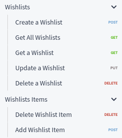

# BigCommerce Wishlist

Easy-to-use Wishlist functionality for BigCommerce themes.

This package provides simple JavaScript methods to:

- Check if a product has already been added to a wishlist.
- Add or remove a product from a wishlist.
- Create, update or remove wishlists.
- Get wishlists details.
- Event listeners for changes on wishlists.

<hr>

In this document:
- [Info](#info)
- [Setup](#setup)
    - [Install package](#install-package)
    - [Required template](#required-template)
    - [Use it in theme](#use-it-in-theme)
    - [Try it yourself](#try-it-yourself)
    - [ECMAScript 6](#ecmascript-6)
- :point_right: [**API Reference**](#api-reference) :point_left:
- [Maintenance](#maintenance)
    - [Lint](#lint)
    - [Test](#test)
    - [Bundle](#bundle)
- [License](#license)

## Info

* **URL:** https://github.com/brandlabs/bigcommerce-wishlist
* **Platform:** BigCommerce


## Setup

### Install package

Install the package as a dependency of your Stencil theme:

```
npm install brandlabs-bigcommerce-wishlist --save-dev
```

### Required template

The post install script will create a Handlebars template file named [`json-this.html`](src/json-this.html) in your Stencil theme at `templates/components/custom` folder.

This template file is required for the package to work

### Use it in theme

- Import the package and you'll get a `WishlistManager` instance.
- Provide `context` to the `init` method. (optional)
- Use the available methods.

```js
import wishlistManager from 'brandlabs-bigcommerce-wishlist';

export default class ProductDetails {
    constructor($scope, context, productAttributesData = {}) {
        // ...
        this.showAddedToWishlist();
    }

    async showAddedToWishlist() {
        // Initialize
        await wishlistManager.init(this.context);

        const productId = $('input[name="product_id"]', this.$scope).val();

        // Check if product belongs to one of the customer's wishlists
        const isAddedToWishlist = await wishlistManager.isProductInAnyWishlist(productId);

        if (isAddedToWishlist) {
            $('.added-to-wishlist').show();
        } else {
            $('.added-to-wishlist').hide();
        }
    }
}
```

### Try it yourself

To quickly try it from browser, simply add these two lines to `assets/js/theme/global.js`:

```js
// Append this line to the imports:
import wishlistManager from 'brandlabs-bigcommerce-wishlist';

export default class Global extends PageManager {
    onReady() {
        // Add this line so you can use the wishlistManager as "wm" from console:
        window.wm = wishlistManager;
    }
}
```

Perform login as a customer into the store, and the `wm` (wishlist manager) functionality will be available from  Dev Tools console to create, update and remove wishlists, add and remove products from wishlists, _etc_.

Use `console.log` as argument to Promise's `then`, to see the results:

```js
wm.getAllWishlists().then(console.log)
````

### ECMAScript 6

The source code from this package is written using ES6 features.

Default Webpack configuration from Cornerstone theme uses Babel to transpile ES6 code within `assets/js` folder. It does not transpile ES6 code from `node_modules`.

To get the transpiled code for this package in your theme bundle, there are three options.

Choose one of them:

1. Import the transpiled version from `dist` folder:

```js
import wishlistManager from 'brandlabs-bigcommerce-wishlist/dist/wishlist-manager.min.js';
```

2. Include `brandlabs-bigcommerce-wishlist` in the paths to transpile. At `webpack.common.js`, update the `include` regular expression:

```js
module.exports = {
    module: {
        rules: [
            {
                test: /\.js$/,
                include: /(assets\/js|assets\\js|stencil-utils|brandlabs-bigcommerce-wishlist)/,
```

3. Use an alias for the `dist` version. At `webpack.common.js`, add one entry for the wishlist package:

```js
module.exports = {
    resolve: {
        alias: {
            'brandlabs-bigcommerce-wishlist': path.resolve(__dirname, 'node_modules/brandlabs-bigcommerce-wishlist/dist/wishlist-manager.min.js'),
```

## API Reference

The main functionality mimics the [BigCommerce Wishlist API](https://developer.bigcommerce.com/api-reference/customer-subscribers/wishlist-api):

[](https://developer.bigcommerce.com/api-reference/customer-subscribers/wishlist-api)

Most methods are asynchronous, returning a Promise which will resolve into the expected result, or reject upon an error.

**METHODS**

- [getAllWishlists](#getAllWishlists) - Get all wishlists for the current customer.
- [getWishlist](#getWishlist) - Get specified wishlist details for the current customer.
- [createWishlist](#createWishlist) - Create a new wishlist for the current customer.
- [deleteWishlist](#deleteWishlist) - Remove a wishlist from the current customer.
- [updateWishlist](#updateWishlist) - Update a wishlist for the current customer.
- [addWishlistItem](#addWishlistItem) - Add a product to a customer wishlist.
- [deleteWishlistItem](#deleteWishlistItem) - Remove a product from a customer wishlist.
- [getAllWishlistsDetails](#getAllWishlistsDetails) - Get all wishlists for the current customer, including the list of items for each one of them.
- [isProductInAnyWishlist](#isProductInAnyWishlist) - Verify if a specific product belongs to any of the customer's wishlists.
- [on](#on) - Register an event listener.
- [off](#off) - Remove an event listener.
- [init](#init) - Initialize the instance with optional context data.

**PROPERTIES**

- [useCache](#useCache) - Whether to use the cache or not.
- [cacheDuration](#cacheDuration) - Time to expire cached data, in minutes.
- [urls](#urls) - Paths to the remote AJAX requests.
- [events](#events) - Event names.
- [wishlists](#wishlists) - Wishlists data.

:warning: Note: In the examples below, we provide both one `then` callback and one event listener, to illustrate how to use them. It is not necessary to use both in real applications. Please choose the option which fits better to your use case.

<hr>

### <a id="getAllWishlists" name="getAllWishlists" href="#getAllWishlists">#</a> async getAllWishlists(forceFetch = false)

Get all wishlists for the current customer.

##### Arguments:

- `{boolean} forceFetch` - True to ignore the cache, False otherwise. Defaults to `false`.


##### Returns:

- `{Promise<array>} wishlists`

##### Usage:

Each object in the returned array shall contain the following properties:

- `id`
- `name`
- `is_public`
- `num_items`
- `token`
- `view_url`
- `edit_url`
- `delete_url`
- `share_url`
- `add_url`


```js
wm.getAllWishlists().then(wishlists => {
    const totalNumberOfItems = wishlists.reduce((total, { num_items }) => total + num_items, 0);
    console.log(`Total number of items in all wishlists is ${totalNumberOfItems}`);
});
```

### <a id="getWishlist" name="getWishlist" href="#getWishlist">#</a> async getWishlist(wishlistid, forceFetch = false)

Get specified wishlist details for the current customer.

##### Arguments:

- `{integer} wishlistid` - Wishlist ID.
- `{boolean} forceFetch` - True to ignore the cache, False otherwise. Defaults to `false`.

##### Returns:

- `{Promise<object>} wishlist`

##### Usage:

The returned object shall contain the following properties:

- `id`
- `name`
- `is_public`
- `is_editable`
- `items`
- `token`
- `share_url`

Note that the properties returned from `getWishlist` differ from the properties returned from `getAllWishlists`.

This is not a "feature" of the package. This reflects what is actually returned from BigCommerce server.

While the wishlist objects returned from  `getAllWishlists` provide the number of items as `num_items`, the object returned from `getWishlist` contains an `items` array with the actual items.

```js
wm.getWishlist(9).then(({ name, items, is_public, share_url }) => {
    console.log(`The "${name}" wishlist contains ${items.length} item${items.length === 1 ? '' : 's'}.`);
    if (is_public) {
        console.log(`It can be shared through this URL: ${share_url}`);
    } else {
        console.log(`It is a private list.`);
    }
});
```

### <a id="createWishlist" name="createWishlist" href="#createWishlist">#</a> async createWishlist({ name, is_public, product_id })

Create a new wishlist for the current customer.

##### Arguments:

- `{Object} params` - The wishlist attributes.
    - `{string} name` - Wishlist name (required).
    - `{boolean} is_public` - Indicates if wishlist is public. Defaults to `false`.
    - `{integer} product_id` - ID of a product to be added to the wishlist (optional).

##### Returns:

- `{Promise<object>} wishlist`

##### Fires:

- `createWishlist({ wishlist })` event

##### Usage:

The returned wishlist object varies:

- If no `product_id` is provided, then it will contain the same properties returned by [`getAllWishlists`](#getAllWishlists)
- If a `product_id` is provided, then it will contain the same properties returned by [`getWishlist`](#getWishlist)

The `createWishlist` event is triggered. The event handler function is called immediately **before** the Promise is resolved.

```js
wm.on('createWishlist', ({ wishlist }) => {
    console.log(`Wishlist "${wishlist.name}" has been created.`);
});

wm.createWishlist({ name: 'Best Wishes' }).then(({ id }) => {
    console.log(`The ID for the new wishlist is ${id}.`);
});
```

### <a id="deleteWishlist" name="deleteWishlist" href="#deleteWishlist">#</a> async deleteWishlist(wishlistid)

Remove a wishlist from the current customer.

##### Arguments:

- `{integer} wishlistid` - Wishlist ID.

##### Returns:

- `{Promise<undefined>}`

##### Fires:

- `deleteWishlist({ wishlistid })` event

##### Usage:

The `deleteWishlist` event is triggered. The event handler function is called immediately **before** the Promise is resolved.

```js
wm.on('deleteWishlist', ({ wishlistid }) => {
    console.log(`Wishlist ID ${wishlistid} has been deleted.`);
});

wm.deleteWishlist(17).then(() => alert('Wishlist deleted!')).catch(error => {
    console.log(`Something went wrong when trying to delete the wishlist.`);
});
```

### <a id="updateWishlist" name="updateWishlist" href="#updateWishlist">#</a> async updateWishlist(wishlistid, { name, is_public })

Update a wishlist for the current customer.

##### Arguments:

- `{integer} wishlistid` - Wishlist ID.
- `{Object} params` - The wishlist attributes.
    - `{string} name` - Wishlist name (required).
    - `{boolean} is_public` - Indicates if wishlist is public (required).

##### Returns:

- `{Promise<object>} wishlist`

##### Fires:

- `updateWishlist({ wishlist })` event

##### Usage:

Both arguments (`name` and `is_public`) will **always** be updated. Even if you want to change only one of them, and keep the other, you need to provide values for both `name` and `is_public`. Otherwise, the `name` will be set to an empty string, and `is_public` will be set to false.

The returned wishlist object contains the same properties returned in [`getAllWishlists`](#getAllWishlists)

The `updateWishlist` event is triggered. The event handler function is called immediately **before** the Promise is resolved.

```js
wm.on('updateWishlist', ({ wishlist }) => {
    console.log(`Wishlist ID "${wishlist.id}" has been updated.`);
});

wm.updateWishlist(9, { name: 'New Wishes', is_public: true }).then(({ name, is_public }) => {
    console.log(`Updated wishlist attributes: name = "${name}", is_public = ${is_public ? 'true' : 'false'}.`);
});
```

### <a id="addWishlistItem" name="addWishlistItem" href="#addWishlistItem">#</a> async addWishlistItem(wishlistid, product_id)

Add a product to a customer wishlist.

##### Arguments:

- `{integer} wishlistid` - Wishlist ID.
- `{integer} product_id` - ID of a product to be added to the wishlist.

##### Returns:

- `{Promise<item>}`

##### Fires:

- `addWishlistItem({ wishlist, item })` event

##### Usage:

The `addWishlistItem` event is triggered. The event handler function is called immediately **before** the Promise is resolved.

The returned `item` object contains several product properties, including `product_id`, `name` and `sku`. It contains also its own `id`.

```js
wm.on('addWishlistItem', ({ wishlist, item }) => {
    console.log(`Product "${item.name}" added to wishlist "${wishlist.name}".`);
});

wm.addWishlistItem(9, 15).then(item => {
    console.log(item);
});
```

### <a id="deleteWishlistItem" name="deleteWishlistItem" href="#deleteWishlistItem">#</a> async deleteWishlistItem(wishlistid, item_id)

Remove a product from a customer wishlist.

##### Arguments:

- `{integer} wishlistid` - Wishlist ID.
- `{integer} item_id` - Wishlist item ID.

##### Returns:

- `{Promise<undefined>}`

##### Fires:

- `deleteWishlistItem({ wishlistid, item_id })` event

##### Usage:

The `deleteWishlistItem` event is triggered. The event handler function is called immediately **before** the Promise is resolved.

```js
wm.on('deleteWishlistItem', ({ wishlistid, item_id }) => {
    console.log(`Item ID ${item_id} from Wishlist ID ${wishlistid} has been removed.`);
    const wishlist = wm.wishlists[wishlistid];
    console.log(`Wishlist "${wishlist.name}" contains ${wishlist.num_items} items now.`);
});

wm.deleteWishlistItem(9, 23).then(() => alert('Wishlist item deleted!')).catch(error => {
    console.log(`Something went wrong when trying to remove item from wishlist.`);
});
```

### <a id="getAllWishlistsDetails" name="getAllWishlistsDetails" href="#getAllWishlistsDetails">#</a> async getAllWishlistsDetails()

Get all wishlists for the current customer, including the list of items for each one of them.

##### Returns:

- `{Promise<array>} wishlists`

##### Usage:

Each object in the returned array shall contain the following properties:

- `id`
- `name`
- `is_public`
- `is_editable`
- `items`
- `num_items`
- `token`
- `view_url`
- `edit_url`
- `delete_url`
- `share_url`
- `add_url`

```js
wm.getAllWishlistsDetails().then(wishlists => {
    const totalNumberOfItems = wishlists.reduce((total, { items }) => total + items.length, 0);
    console.log(`Total number of items in all wishlists is ${totalNumberOfItems}`);
});
```

### <a id="isProductInAnyWishlist" name="isProductInAnyWishlist" href="#isProductInAnyWishlist">#</a> async isProductInAnyWishlist(product_id)

Verify if a specific product belongs to any of the customer's wishlists.

##### Returns:

- `{Promise<boolean>} belongs`

##### Usage:

The Promise resolves to True if the specified product ID belongs to any wishlist, False otherwise.

```js
const product_id = 15;

wm.isProductInAnyWishlist(product_id).then(wished => {
    console.log(`Product ID ${product_id} is ${wished ? 'a wished product!' : 'not in any wishlist.'}`);
});
```

### <a id="on" name="on" href="#on">#</a> on(name, callback)

Register an event listener.

##### Arguments:

- `{string} name` - The event name.
- `{Function} callback` - The function to run when the event is triggered.

##### Usage:

All methods which changes the wishlists trigger events.

See the reference of each method for details on the provided event parameters:

- [createWishlist](#createWishlist)
- [deleteWishlist](#deleteWishlist)
- [updateWishlist](#updateWishlist)
- [addWishlistItem](#addWishlistItem)
- [deleteWishlistItem](#deleteWishlistItem)

```js
const onCreateWishlist = ({ wishlist }) => {
    console.log(`A new ${wishlist.is_public ? 'public' : 'private' } wishlist called "${wishlist.name}" has been created.`);
};

wm.on('createWishlist', onCreateWishlist);
```

### <a id="off" name="off" href="#off">#</a> off(name, callback)

Remove an event listener.

##### Arguments:

- `{string} name` - The event name.
- `{Function} callback` - The function to be removed from listeners.

##### Usage:

In order to be able to remove an event listener, it is important to have a reference to it.

So, if your code will remove event listeners, it is better to avoid anonymous functions when registering them.

```js
// GOOD EXAMPLE:
const onCreateWishlist = ({ wishlist }) => {
    console.log(`A new ${wishlist.is_public ? 'public' : 'private'} wishlist called "${wishlist.name}" has been created.`);
};

wm.on('createWishlist', onCreateWishlist);

wm.off('createWishlist', onCreateWishlist);

// AVOID USING ANONYMOUS FUNCTIONS:
wm.on('deleteWishlist', () => console.log('A wishlist has been removed.'));

wm.off('deleteWishlist', wm.eventListeners['deleteWishlist'][0]); // Not reliable. Not recommended.
```

### <a id="init" name="init" href="#init">#</a> async init({ wishlists, urls } = {})

Initialize the instance with optional context data.

##### Arguments:

- `{Object} context` - Stencil context.
    - `{array} wishlists` - Wishlists.
    - `{object} urls` - URLs.

##### Usage:

The call to `init` method is not mandatory. It is optional. The `context` parameter is also optional.

This is exactly what `init` does:

```js
    // Use wishlists URLs from context
    if (urls && urls.account && urls.account.wishlists) {
        Object.assign(this.urls, urls.account.wishlists);
    }

    // Cache warming
    if (this.useCache) {
        this.getAllWishlistsFromCache();
    }

    // Initial wishlists fetch, if not available in context
    if (Array.isArray(wishlists)) {
        this.setWishlists(wishlists);
    } else {
        await this.getAllWishlists(true);
    }
```

:one: Stencil context usually contains wishlists URL information, at `context.urls.account.wishlists`. The `init` method will configure the instance to use the context URLs. This usually will make no difference at all, since the configured defaults correspond to the values used by all BigCommerce stores.

:two: Loads data from cache into the instance's `wishlists` property.

:three: If a `wishlists` array is provided in `context`, it will be used as initial source of truth, populating the instance's `wishlists` property data. Otherwise, an AJAX call to BigCommerce will be made to retrieve the initial `wishlists` data.

Thus, this initial HTTP request to BigCommerce server can be avoided if `wishlists` is injected into the context. This can be achieved from the Handlebars page templates in the theme. This is done through a front-matter entry, and the usage of Handlebars `inject` helper, like this:

```
---
customer:
   wishlists:
     limit:10
---
{{inject "wishlists" customer.wishlists}}
```

<hr>

### <a id="useCache" name="useCache" href="#useCache">#</a> wm.useCache

- **Type**: `boolean`

- **Default**: `true`

- **Details**:<br>
From the moment this is set to `false`, the cache will not be read anymore.<br>
If set to `true`, the cache will be available for reading.<br>
This setting does not affect the write operations to the cache.

```
// To completely skip reading cache, turn it off before calling init
wm.useCache = false;
wm.init(this.context);
```

### <a id="cacheDuration" name="cacheDuration" href="#cacheDuration">#</a> wm.cacheDuration

- **Type**: `integer`

- **Default**: `60`

- **Details**:<br>
Time to expire cached data, in minutes.<br>
This does not imply on cache data deletion.<br>
If there is data stored in cache 90 minutes ago, it will be discarded when reading.<br>
In this case, if `cacheDuration` is modified to 120, the next cache read operations will not discard anumore the data which has been stored in cache 90 minutes ago.

```
// It is recommended to set the preferred value for cacheDuration before calling init
wm.cacheDuration = 360;
wm.init(this.context);
```

### <a id="urls" name="urls" href="#urls">#</a> wm.urls

- **Type**: `object`

- **Default**:

```js
{
    base: window.location.origin,
    all: '/wishlist.php',
    add: '/wishlist.php?action=addwishlist',
    edit: '/wishlist.php?action=editwishlist',
    delete: '/wishlist.php?action=deletewishlist',
    view: '/wishlist.php?action=viewwishlistitems',
    add_item: '/wishlist.php?action=add',
    delete_item: '/wishlist.php?action=remove',
    share: '/wishlist.php?action=sharewishlist',
}
```

- **Details**:<br>
URLs used for the remote AJAX requests.<br>
They can be changed/configured.

```
// Use a test or proxy domain to receive the requests
wm.urls.base = 'https://example.com';
```

### <a id="events" name="events" href="#events">#</a> wm.events

- **Type**: `object`

- **Default**:

```js
{
    createWishlist: 'createWishlist',
    deleteWishlist: 'deleteWishlist',
    updateWishlist: 'updateWishlist',
    addWishlistItem: 'addWishlistItem',
    deleteWishlistItem: 'deleteWishlistItem',
}
```

- **Details**:<br>
Instead of using hard-coded strings, it is possible to refer the events from this object property.<br>
The event names can also be changed/configured.

```
wm.events.createWishlist = 'wishlistCreated';
wm.events.deleteWishlist = 'wishlistDeleted';

wm.on('wishlistCreated', () => 'A wishlist has been created.');
wm.on(wm.events.deleteWishlist, () => 'A wishlist has been deleted.');

wm.on(wm.events.updateWishlist, () => 'A wishlist has been updated.');
```

### <a id="wishlists" name="wishlists" href="#wishlists">#</a> wm.wishlists

- **Type**: `object`

- **Details**:<br>
Contains all wishlist data read from cache, or from remote requests, or changed via any of the method calls.<br>
It always contains the most complete and up-to-date wishlists data the WishlistManager instance is aware of.<br>
It is a dictonary keyed by the wishlist ID.

```
async foo() {
    await wm.getWishlist(5);
    const productIds = wm.wishlists[5].items.map(item => item.product_id);
}

async bar() {
    await wm.getAllWishlistsDetails();
    console.log(wm.wishlists); // ALL data is in here
}
```

The `wishlists` property is suitable to be used in a reactive context.

Here is a Vue JS 3 example:

```js
wm.wishlists = Vue.reactive({});
wm.init();

Vue.createApp({
    data: () => ({ wishlists: wm.wishlists }),
    template: `
        <table id="wm">
            <tr><th>ID</th><th>Name</th><th>Shared</th><th>Items</th></tr>
            <tr v-for="wishlist in wishlists">
                <td>{{ wishlist.id }}</td>
                <td>{{ wishlist.name }}</td>
                <td>{{ wishlist.is_public ? 'public' : 'private' }}</td>
                <td v-if="wishlist.items">{{ wishlist.items.map(item => item.name).join(', ') }}</td>
                <td v-else>{{ wishlist.num_items }} item{{ wishlist.num_items === 1 ? '' : 's' }}</td>
            </tr>
        </table>`,
}).mount($('<div>').appendTo('body').get(0));
```

With this setup, any change done using the "create", "update", "delete", "add item" or "remove item" is automatically reflected in the HTML table, without any `then` callback, any event listener or any other kind of post-processing.

## Maintenance

For development of this package, we use:

- ESLint for linting JS code
- Jest for testing
- Webpack for bundling

### Lint

To lint the scripts, run `npm run lint`

### Test

To perform the tests, run `npm run test`

### Bundle

To generate the `dist` folder and build bundle assets, run `npm run build`

## License

This project is licensed under the MIT License - see the [LICENSE](LICENSE) file for details

[](https://www.brandlabs.us/?utm_source=gitlab&utm_medium=technology_referral&utm_campaign=brandlabs-bigcommerce-wishlist)
